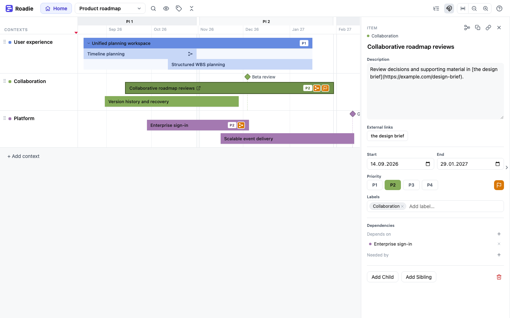

# Roadie

Roadie is a focused roadmap editor for people planning large software and
systems projects. It helps communicate significant outcomes, when they are
expected, how they decompose, and what depends on what—without becoming another
task tracker.

This guide will explain both how to use Roadie and how to construct roadmaps
that remain useful at scale.

## Start here

If you are new to Roadie, begin with [Key concepts](concepts.md), then read
[Managing roadmaps](managing-roadmaps.md).

The remaining guides cover particular parts of Roadie:

- [Integration milestones](integration-milestones.md) explains how to connect
  independently maintained roadmaps through milestones they share.
- [Version history](version-history.md) explains how earlier versions are kept,
  compared, and restored.
- [Finding missing Jira links](jira-reconciliation.md) explains how to find and
  link Jira issues and Roadie items that are missing references.
- [Schedule check](schedule-check.md) compares issue schedules in Jira with the
  dates in a roadmap.
